# 🏠 Melbourne Housing Price Predictor

## 1. Project Overview
**Goal:** To gather data about Melbourne housing market, determine the best model for representing it and finally making it all work as accurately as possible.

### Data Source 
https://www.kaggle.com/datasets/anthonypino/melbourne-housing-market

---

## 2. Data Engineering & Cleaning
To stabilize the model, several critical data fixes were performed:

### Handling Missing Values
* **Dropped rows where `Price` or `Regionname` were null as it was not feasible to fill them with median data, the price column was missing about 22% of data.
* **Imputation:** Used `SimpleImputer(strategy="median")` for numerical features like `BuildingArea` and `Car` to ensure all data is present for the model.

### Outlier Management
The raw data contained luxury "mansions" up to $11M and very cheap places that skewed the model's logic. To reduce that, I found 99th percetile and removed everything above that, I also set a low threshold of $250K to remove the very cheap options.

* **Result:** Reduced the "Honest Error" (CV) significantly by narrowing the scope to the general market. It also significantly improved the data visualization as the $11M masions were making everything else look the same in the eyes of the colourmap, hence it was very difficult to read anything but the very expensive housing patterns from the plot.

### Feature Engineering
* **House Age Calculation:** Derived `Age` from `YearBuilt` (`2026 - YearBuilt`) in hopes it would improve the prediction accuarcy, which it did, marginally.
* **Location Density:** Replaced broad `Regionname` with specific `Suburb` data to capture more localized prices. Suburbs category is more constrained than Regionname, thus my resoning was that it will be more accurate for pricing prediction.

---

## 3. The ML Pipeline
The preprocessing was automated using a Scikit-Learn `ColumnTransformer` to ensure consistency between training and testing.

| Transformer | Columns | Description |
| :--- | :--- | :--- |
| **Numerical** | Rooms, Distance, Landsize, Age... | Median Imputation + Standard Scaling |
| **Categorical** | Suburb, Type | One-Hot Encoding |

---

## 4. Model Configuration
**Algorithm:** `RandomForestRegressor`

To prevent the model from "memorizing" specific houses, the following constraints were applied:
* `n_estimators=100`
* `max_depth=15` (Preventing overly complex trees)
* `min_samples_leaf=5` (Ensuring rules are based on groups, not single houses)

---

## 5. Results & Evaluation

### Error Metrics
* **Training RMSE:** ~$166,719.77
* **Cross-Validation Mean:** ~$208,265 (The "Honest" Error)

Success "Performance Insight"
    By cleaning the data and constraining the model, reduced the Cross-Validation error from **$300k+** to **$220k**, creating a more stable and reliable predictor.

### Top Price Drivers
1. **Distance:** (31%) - Proximity to Melbourne CBD is the #1 predictor.
2. **Type of dwelling (house vs apartment):** (18%) - Distinguishes between Houses, Units, and Townhouses.
3. **Post Code:** (17%) - Distinguishes between Suburbs really.

---

## 6. Future Improvements
* **School Zones:** Incorporate school catchment data.
* **Renovation Status:** Add a feature for "Newly Renovated" vs "Original Condition."
* **Hyperparameter Tuning:** Use `GridSearchCV` to find the optimal balance of depth and leaf size.

## 6. Conclusion (Until improvements are made)

While the model is currently fairly stable, it still has a huge margin of error by real world standard. There is no way anybody can use this model to buy a property when the property might be ~$200k AUD more expensive than assumed.

## 7. The Code

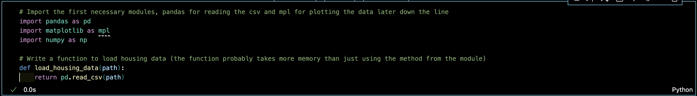
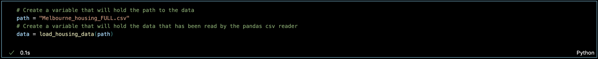
I have adjusted the percentile to be 99, meaning the values is $AUD 2.4 Million, not 2.6 as shown in the screenshot. This means the `cutoff = 2600000` has been amended to be `cutoff = 2400000` in the code.
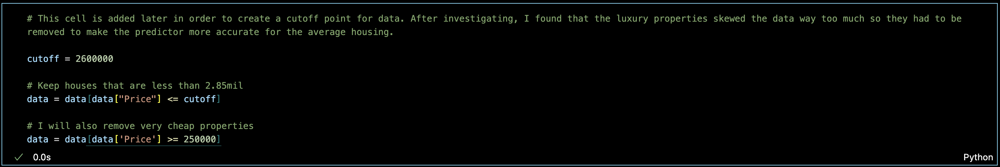
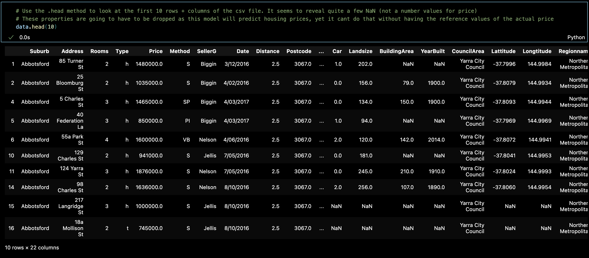
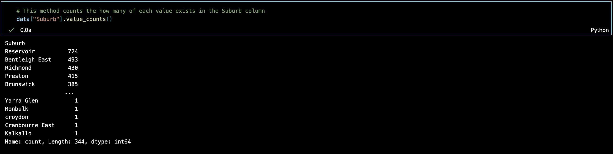
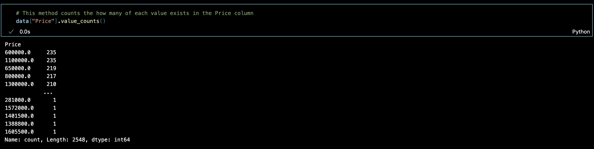
Note that this picture displays the values descending from $AUD 2.6 million, however the code was later amended to include houses with a maximum price of $AUD 2.4 million.
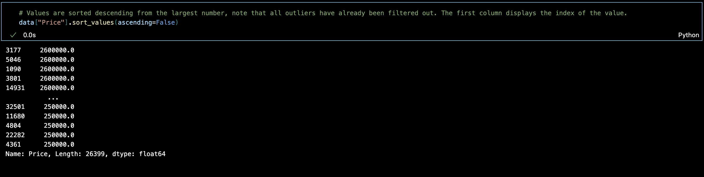
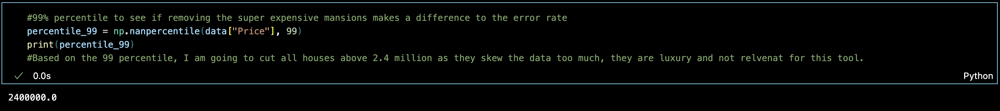
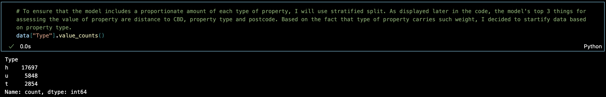
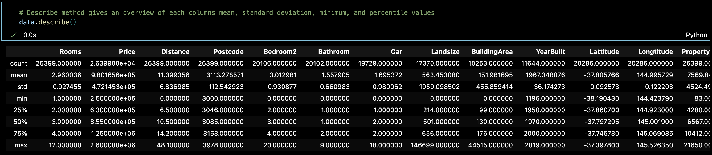
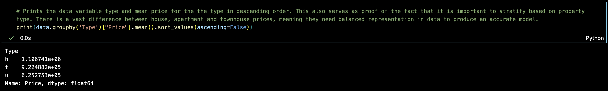
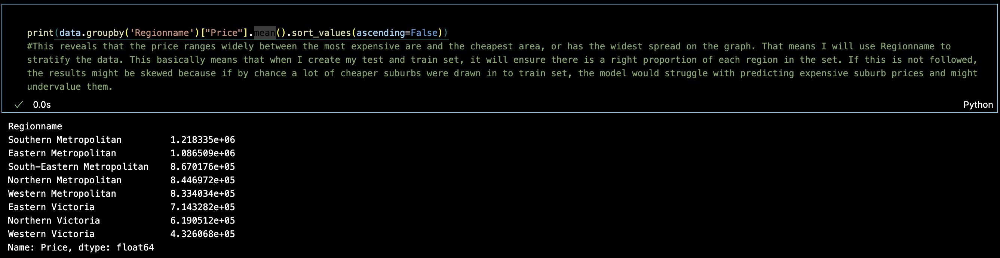
To clarify, the reason the missing "Price" instances need to be removed is that they account for around 20% of all the values, if all of those instances would be assigned the mean value, it would very much not represent accurate data, as 1 in every 5 house would cost the same, despite other features, which may vary widely.
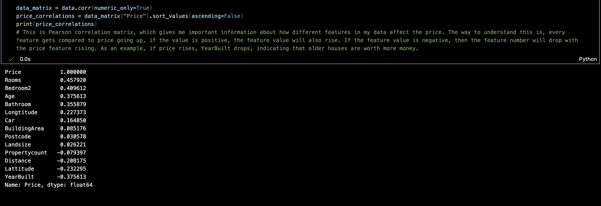
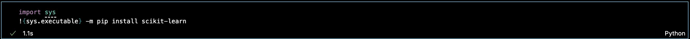
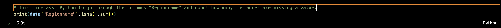
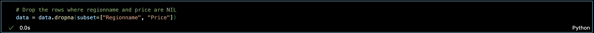
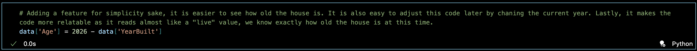
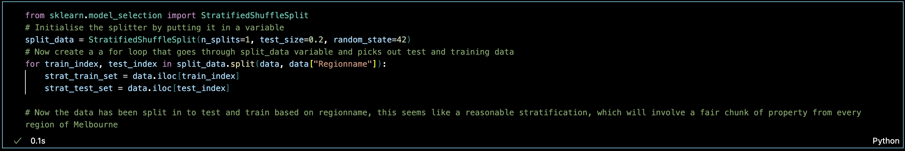
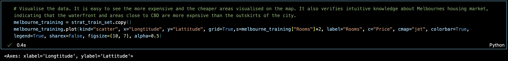
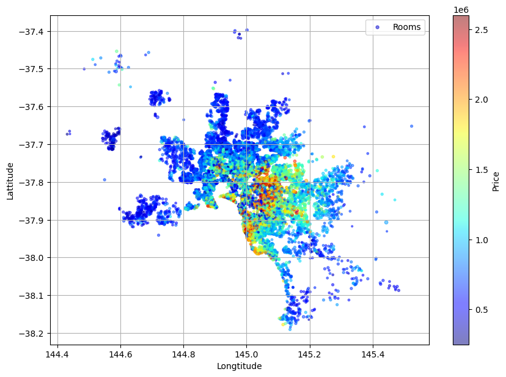
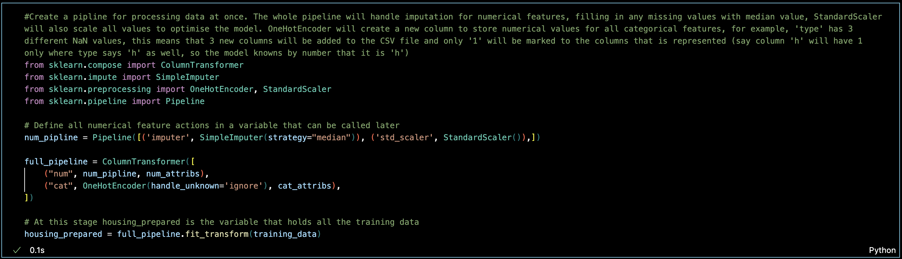
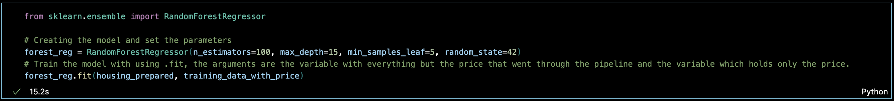
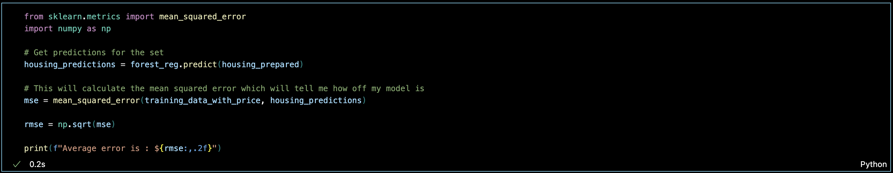
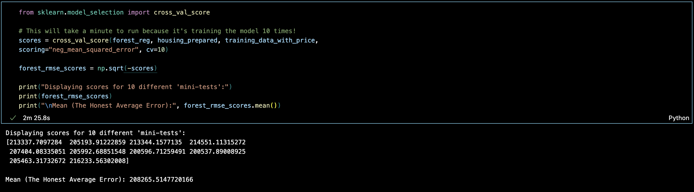
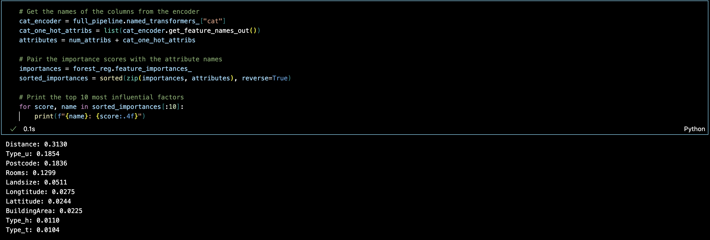
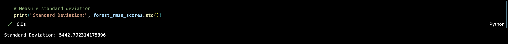
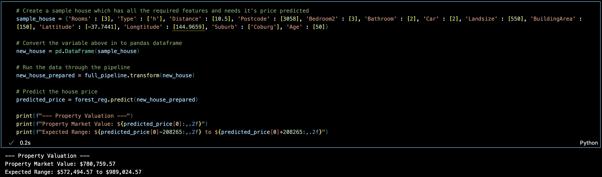

https://www.domain.com.au/9-morris-street-coburg-north-vic-3058-2014576806