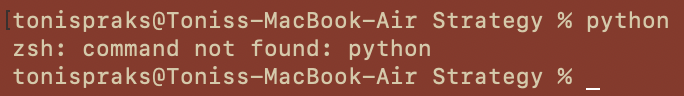
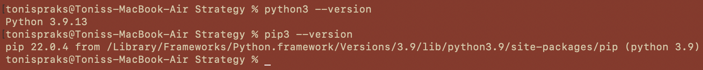

# Installing Python and Pip

To use Python, you must have **Python 3** and **pip** (Python's package manager) installed on your system. Follow the steps for your operating system below.

---

## 1. Check if Python is already installed
Open your terminal (Command Prompt, PowerShell, or Terminal) and type:

python --version (could be python3 --version)

If you see something like this:

**macOS/Linux: zsh: command not found: python or bash: command not found**

**Windows: 'python' is not recognized as an internal or external command**

This means Python is not installed.
If the command returns a version number, as displayed on the image above, then Python is installed.

## 2. Install Python

### macOS

1. Download the latest version of Python from the [official website](https://www.python.org/downloads/).
2. Run the installer and make sure to check the box that says "Add Python to PATH".
3. Restart your terminal and try checking for version.

### Windows

1. Download the latest version of Python from the [official website](https://www.python.org/downloads/).
2. Run the installer and make sure to check the box that says "Add Python to PATH".
3. Restart your terminal and try checking for version.

### Why add Python to PATH?

Adding Python to PATH allows you to run Python from the command line. This is necessary for using pip to install packages. Basically, adding Python to PATH means saving Python commands in a directory where your computer will look for them when you type a command. The difference is when it is not in PATH, you will see something like in step 1, where it says "zsh: command not found: python" or "bash: command not found: python". This means that the computer cannot find the Python command. When it is in PATH, it will find the Python command, because it is saved in a directory where the computer will look for it.

## 3. Verify Installation

Run the following commands:

**python --version (could be python3 --version on macOS)**

**pip --version (could be pip3 --version on macOS)**

If both commands return a version number, then Python has successfully been installed.

---
