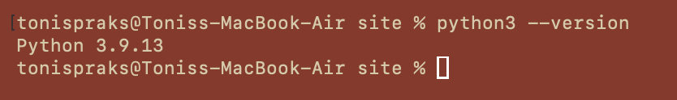

# Installing Python and Pip

To use Python, you must have **Python 3** and **pip** (Python's package manager) installed on your system. Follow the steps for your operating system below.

---

## 1. Check if Python is already installed
Open your terminal (Command Prompt, PowerShell, or Terminal) and type:

python --version (could be python3 --version)
